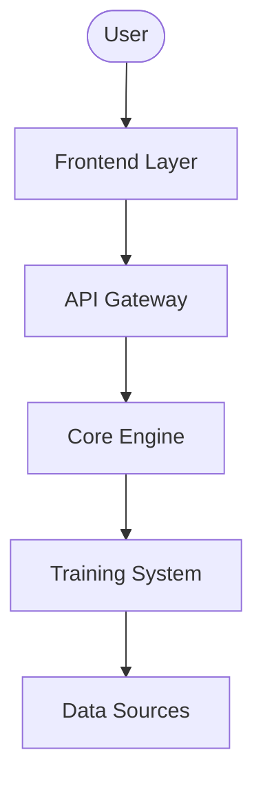
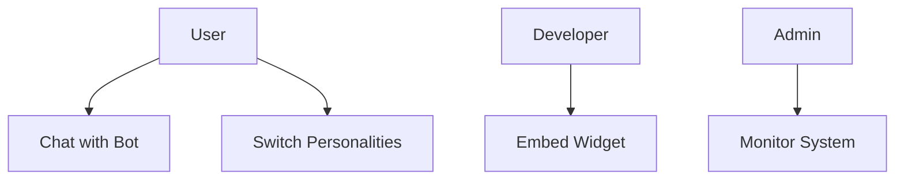
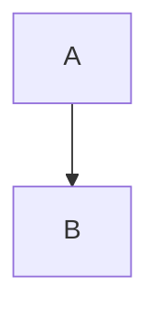

# 🎨 KoinToss Diagram Generation Guide

This guide demonstrates multiple approaches to generating diagrams from your existing code system, including flow diagrams, use case diagrams, system architecture diagrams, and more.

## 📊 Available Diagram Types

### 1. **Mermaid Diagrams** (Interactive Web Format)
- ✅ **Generated:** 15 different diagram files
- 🌐 **Format:** `.mermaid` files that render in browsers, GitHub, GitLab
- 🎯 **Best for:** Documentation, web integration, collaborative reviews

#### Generated Mermaid Files:
```
✅ file_structure.mermaid          - Project file organization
✅ class_diagram.mermaid           - Basic class relationships  
✅ dependency_graph.mermaid        - Module dependencies
✅ call_flow.mermaid              - Function call sequences
✅ enhanced_class_diagram.mermaid  - Advanced class diagram with complexity
✅ architecture_flow.mermaid       - System architecture layers
✅ interaction_sequence.mermaid    - Component interactions
✅ complexity_heatmap.mermaid      - Code complexity visualization
✅ dependency_network.mermaid      - Network-style dependencies
✅ user_journey.mermaid           - User experience flow
✅ use_case_diagram.mermaid       - Use cases and actors
✅ conversation_flow.mermaid      - Chat flow logic
✅ api_flow.mermaid              - API request sequences
✅ system_state.mermaid          - System state transitions
✅ data_flow_detailed.mermaid    - Data processing flow
```

### 2. **GraphViz DOT Diagrams** (Professional Quality)
- ✅ **Generated:** 3 DOT format files
- 🖼️ **Format:** `.dot` files (convert to PNG/SVG/PDF)
- 🎯 **Best for:** High-quality publications, formal documentation

#### Generated DOT Files:
```
✅ class_hierarchy.dot        - Class inheritance structure
✅ module_dependencies.dot    - Module dependency graph  
✅ system_architecture.dot    - Layered system architecture
✅ convert_diagrams.sh       - Conversion script for images
```

### 3. **Interactive D3.js Diagrams** (Dynamic Web)
- ✅ **Generated:** Interactive HTML file
- 🌐 **Format:** HTML with D3.js visualizations
- 🎯 **Best for:** Presentations, interactive exploration

#### Generated Interactive File:
```
✅ KoinToss_D3_Interactive_Diagrams.html - Interactive network diagrams
```

### 4. **Existing Comprehensive Documentation**
- ✅ **PlantUML diagrams:** `KoinToss_PlantUML_Diagrams.md`
- ✅ **Interactive Mermaid:** `KoinToss_Interactive_Diagrams.html`
- ✅ **Technical docs:** `KoinToss_Bot_Technical_Documentation.md`

## 🚀 How to Use Generated Diagrams

### **View Mermaid Diagrams:**

1. **In VS Code:** Install Mermaid Preview extension
2. **Online:** Copy content to http://mermaid.live
3. **GitHub/GitLab:** Paste in Markdown files (auto-renders)
4. **Documentation sites:** Most support Mermaid natively

### **Convert DOT to Images:**

```bash
# Install GraphViz first
# Ubuntu/Debian: sudo apt-get install graphviz
# macOS: brew install graphviz  
# Windows: Download from https://graphviz.org/download/

# Convert to PNG
dot -Tpng class_hierarchy.dot -o class_hierarchy.png

# Convert to SVG (scalable)
dot -Tsvg module_dependencies.dot -o module_dependencies.svg

# Convert to PDF (professional)
dot -Tpdf system_architecture.dot -o system_architecture.pdf

# Use the provided script (Linux/Mac)
chmod +x convert_diagrams.sh
./convert_diagrams.sh
```

### **View Interactive Diagrams:**

1. **D3.js Interactive:**
   - Open `KoinToss_D3_Interactive_Diagrams.html` in any browser
   - Interactive controls for exploration
   - Drag nodes, hover for details, filter views

2. **Mermaid Interactive:**
   - Open `KoinToss_Interactive_Diagrams.html` in browser
   - Static but beautifully rendered
   - Multiple diagram types in one view

## 📈 Diagram Examples

### **Sample Class Diagram** (Enhanced):
```mermaid
classDiagram
    class ImprovedDualPersonalityChatbot:::high-complexity
    class PureNormalTrainer:::medium-complexity
    class PureSubZeroTrainer:::medium-complexity
    
    ImprovedDualPersonalityChatbot : +complexity: 25
    ImprovedDualPersonalityChatbot : 🔓process_message(message)
    ImprovedDualPersonalityChatbot : 🔓switch_personality(mode)
    
    PureNormalTrainer <|-- ImprovedDualPersonalityChatbot
    PureSubZeroTrainer <|-- ImprovedDualPersonalityChatbot
```

### **Sample Flow Diagram**:


### **Sample Use Case**:


## 🛠️ Code Analysis Features

The diagram generators analyze your code and extract:

- **Classes & Methods:** Structure and relationships
- **Dependencies:** Import relationships and connections  
- **Complexity:** Cyclomatic complexity scoring
- **Flow Logic:** Call sequences and data flow
- **Architecture:** Layer organization and patterns

## 🎯 Use Cases for Each Diagram Type

### **Documentation:**
- Class diagrams → Code structure
- Flow diagrams → Process understanding  
- Use cases → Feature overview
- Architecture → System design

### **Development:**
- Dependency graphs → Refactoring guidance
- Complexity maps → Code quality assessment
- Call flows → Debugging assistance
- State diagrams → Behavior modeling

### **Presentations:**
- Interactive D3.js → Stakeholder demos
- GraphViz exports → Formal reports
- Mermaid → Technical discussions
- Journey maps → User experience design

## 🔧 Generator Scripts

### **Available Generators:**
```bash
python code_diagram_generator.py        # Basic analysis & Mermaid
python advanced_diagram_generator.py    # Enhanced features & complexity  
python graphviz_dot_generator.py        # Professional DOT format
python use_flow_diagram_generator.py    # Use cases & user flows
```

### **Customization Options:**
- Modify color schemes in diagram code
- Adjust complexity thresholds
- Filter by file types or patterns
- Add custom analysis rules
- Export to different formats

## 📚 Integration Examples

### **In Documentation Systems:**

**Sphinx/MkDocs:**
```markdown

```

**Confluence/Notion:**
- Upload SVG/PNG exports
- Embed interactive HTML
- Link to live Mermaid files

**GitHub/GitLab:**
- Include .mermaid files in README
- Reference in issue templates
- Use in wiki pages

### **In Presentations:**
- Export high-res PNG/SVG from DOT files
- Embed interactive HTML in slides
- Use Mermaid in Markdown presentations

## 🎨 Diagram Viewing Tools

### **Online Viewers:**
- **Mermaid Live:** https://mermaid.live
- **PlantUML:** http://www.plantuml.com/plantuml/
- **GraphViz Online:** https://dreampuf.github.io/GraphvizOnline/

### **VS Code Extensions:**
- Mermaid Preview
- PlantUML
- GraphViz Preview
- Markdown Preview Enhanced

### **Desktop Tools:**
- yEd Graph Editor (GraphML import)
- Lucidchart (diagram import)
- Draw.io/Diagrams.net (various formats)

## 🚀 Next Steps

1. **View Generated Diagrams:**
   - Open HTML files in browser
   - Preview .mermaid files in VS Code
   - Convert DOT files to images

2. **Customize & Extend:**
   - Modify generator scripts for specific needs
   - Add new diagram types
   - Integrate with CI/CD for auto-updates

3. **Documentation Integration:**
   - Add diagrams to README
   - Include in technical documentation
   - Use in presentations and reports

4. **Collaborative Review:**
   - Share interactive diagrams with team
   - Use for architecture discussions
   - Include in code review process

---

🎉 **You now have a comprehensive suite of diagram generation tools and multiple visualization formats for your KoinToss system!**
