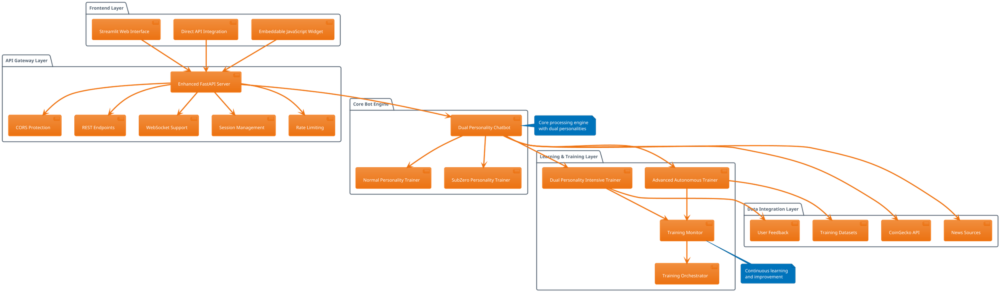
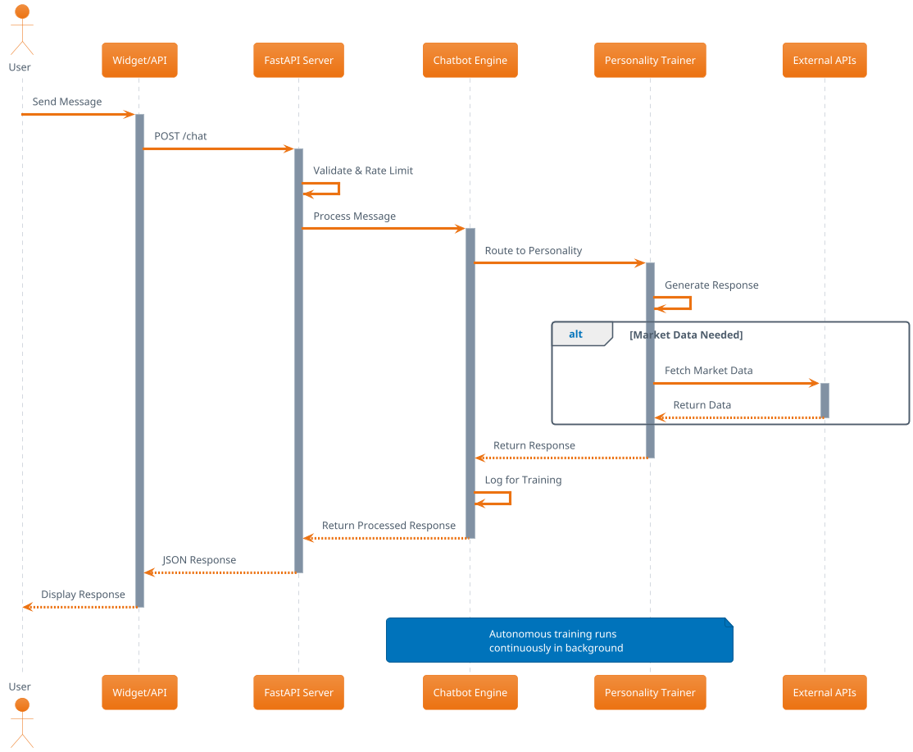
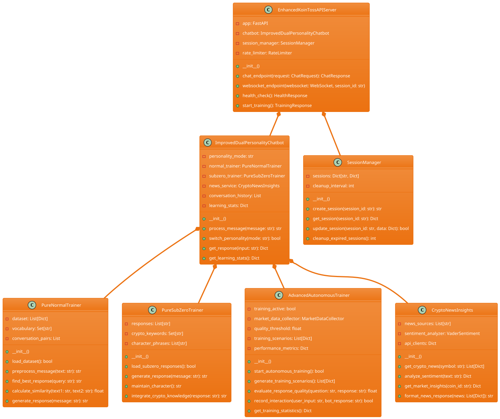
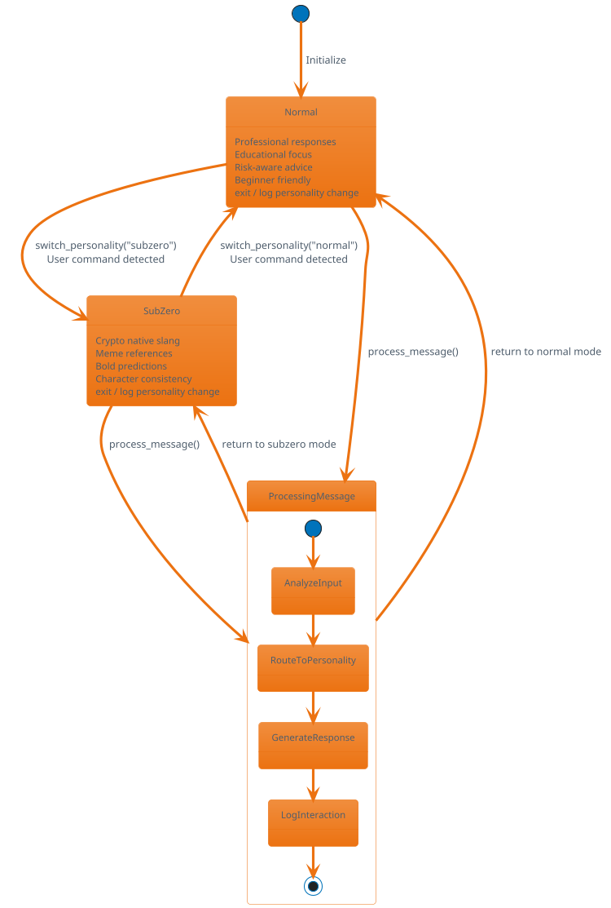
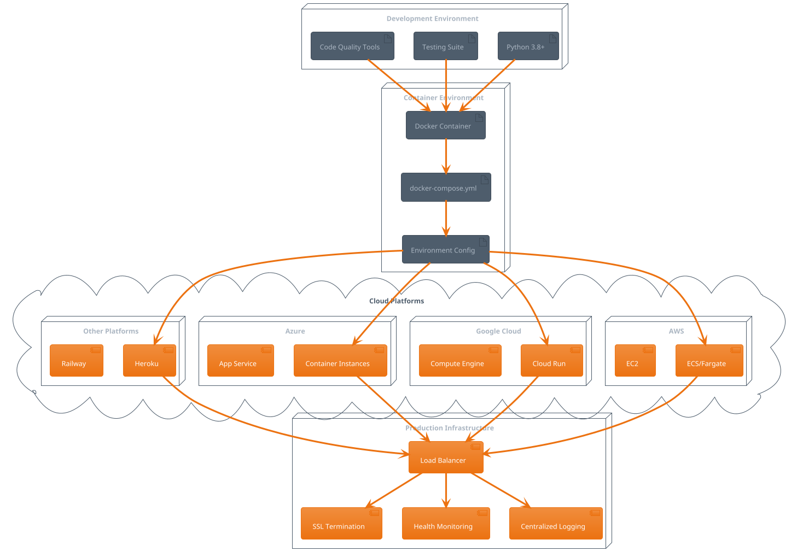
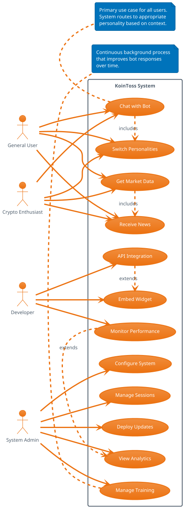
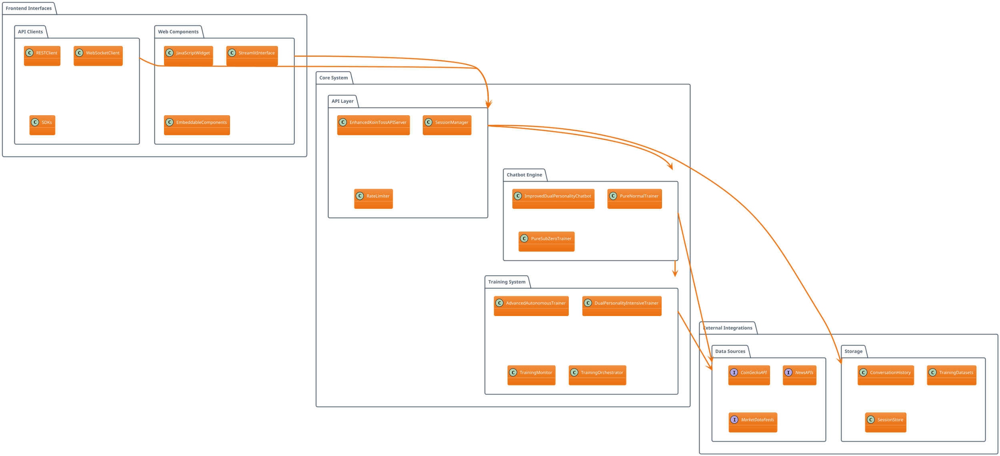
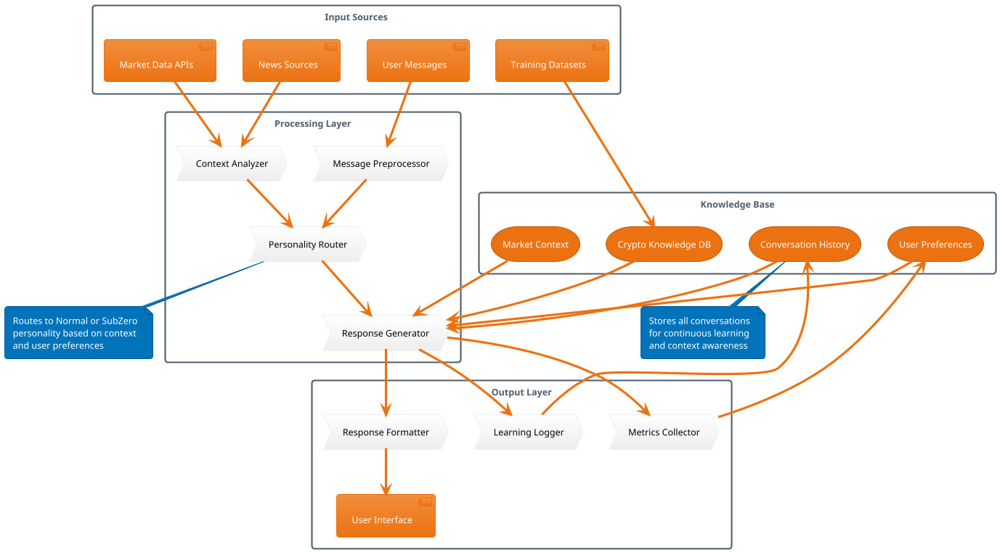

# KoinToss System Diagrams - PlantUML Format

This document contains all system diagrams in PlantUML format, which can be rendered in various documentation systems and converted to multiple formats.

## 1. System Architecture (Component Diagram)



## 2. Sequence Diagram - Chat Request Flow



## 3. Class Diagram - Core Components



## 4. State Diagram - Personality Switching



## 5. Activity Diagram - Training Process

```plantuml
@startuml Training_Process_Activity
!theme aws-orange

start

:Start Autonomous Training;

:Collect Market Data;

:Generate Training Scenarios;

:Test Both Personalities;

fork
    :Test Normal Personality;
    :Evaluate Normal Response;
fork again
    :Test SubZero Personality;
    :Evaluate SubZero Response;
end fork

:Calculate Quality Scores;

if (Quality Score > Threshold?) then (yes)
    :Update Training Data;
    :Record Successful Pattern;
else (no)
    :Generate Alternative Response;
    :Re-evaluate Quality;
endif

:Update Performance Metrics;

:Generate Training Analytics;

if (Continue Training?) then (yes)
    :Wait for Next Cycle;
    backward :Collect Market Data;
else (no)
    :Save Training Session;
    :Generate Report;
    stop
endif

note right
    Background processes:
    - Real-time market monitoring
    - User interaction logging
    - Pattern recognition
    - Quality assessment
end note

@enduml
```

## 6. Deployment Diagram



## 7. Use Case Diagram



## 8. Package Diagram - System Structure



## 9. Network Diagram - Production Architecture

```plantuml
@startuml Network_Architecture
!theme aws-orange

!define AWSPUML https://raw.githubusercontent.com/awslabs/aws-icons-for-plantuml/v15.0/dist
!includeurl AWSPUML/AWSCommon.puml
!includeurl AWSPUML/ApplicationIntegration/APIGateway.puml
!includeurl AWSPUML/Compute/ECS.puml
!includeurl AWSPUML/Database/ElastiCache.puml
!includeurl AWSPUML/NetworkingContentDelivery/CloudFront.puml

actor Users as users

cloud Internet {
    CloudFront(cdn, "CloudFront CDN", "Static Assets")
}

rectangle "Load Balancer" as lb {
    component "Nginx/ALB" as nginx
    component "SSL Termination" as ssl
}

rectangle "Application Tier" as app {
    ECS(ecs, "Container Service", "FastAPI Application")
    component "KoinToss API" as api
    component "WebSocket Server" as ws
}

rectangle "Caching Layer" as cache {
    ElastiCache(redis, "Redis Cache", "Sessions & Responses")
}

rectangle "External Services" as external {
    component "CoinGecko API" as coingecko
    component "News APIs" as news
    component "Market Data" as market
}

rectangle "Monitoring & Logging" as monitoring {
    component "Health Checks" as health
    component "Metrics Collection" as metrics
    component "Log Aggregation" as logs
}

users --> cdn
users --> nginx
cdn --> nginx
nginx --> ssl
ssl --> ecs
ecs --> api
ecs --> ws
api --> redis
ws --> redis
api --> coingecko
api --> news
api --> market
ecs --> health
health --> metrics
metrics --> logs

note bottom of ecs
    Auto-scaling enabled
    Multiple availability zones
    Rolling deployments
end note

note bottom of redis
    Session persistence
    Response caching
    Rate limiting data
end note

@enduml
```

## 10. Data Flow Diagram



---

## Usage Instructions

### Rendering PlantUML Diagrams

These diagrams can be rendered using:

1. **Online PlantUML Editor**: http://www.plantuml.com/plantuml/
2. **VS Code Extension**: PlantUML extension
3. **IntelliJ IDEA**: Built-in PlantUML support
4. **Command Line**: 
   ```bash
   java -jar plantuml.jar diagram.puml
   ```
5. **Confluence/Jira**: Native PlantUML support
6. **GitHub**: PlantUML proxy service
7. **GitLab**: Built-in PlantUML rendering

### Export Formats

PlantUML supports multiple output formats:
- **PNG**: For documentation and presentations
- **SVG**: For scalable vector graphics
- **PDF**: For formal documentation
- **ASCII**: For text-based documentation
- **LaTeX**: For academic papers

### Integration Options

- **Documentation Systems**: Sphinx, GitBook, MkDocs
- **Wiki Systems**: MediaWiki, Confluence, Notion
- **Issue Tracking**: Jira, GitHub Issues
- **Presentation Tools**: RevealJS, PowerPoint
- **Code Documentation**: Doxygen, JSDoc

### Customization

Each diagram can be customized with:
- **Themes**: AWS, Azure, Google Cloud themes available
- **Colors**: Custom color schemes
- **Fonts**: Typography customization
- **Layout**: Direction and positioning control
- **Styling**: Line styles, shapes, and icons

---

*These PlantUML diagrams provide a comprehensive technical view of the KoinToss system architecture and can be easily integrated into any documentation system or presentation.*
