# KoinToss System Architecture Diagrams

This document contains comprehensive diagrams showing the architecture, flow, and components of the KoinToss dual-personality crypto chatbot system.

## 1. System Architecture Diagram

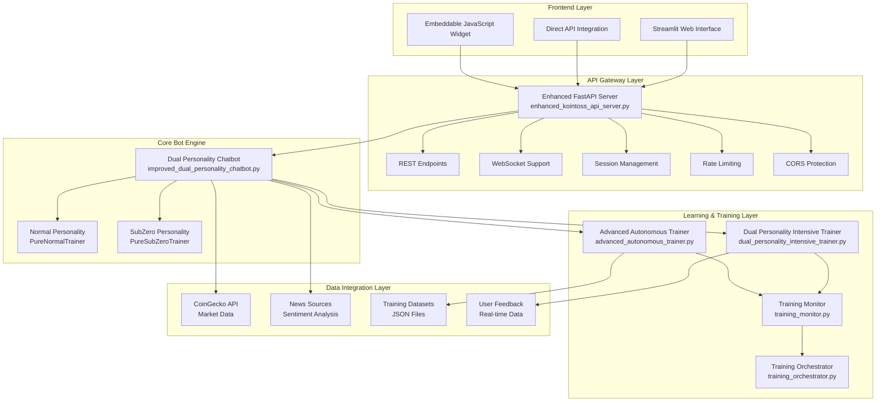

## 2. Request Flow Diagram

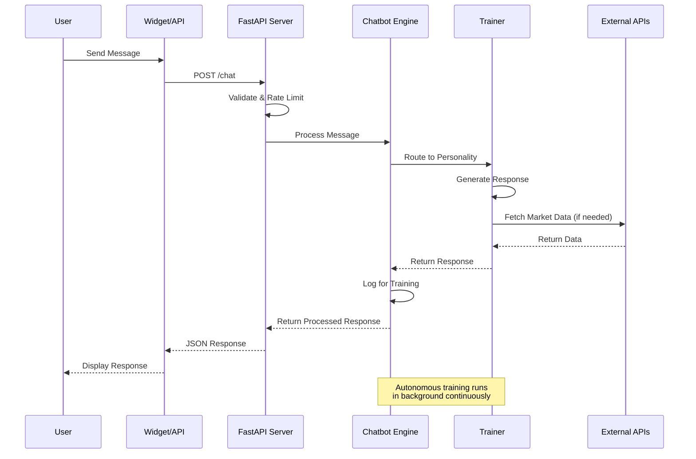

## 3. Dual Personality Architecture

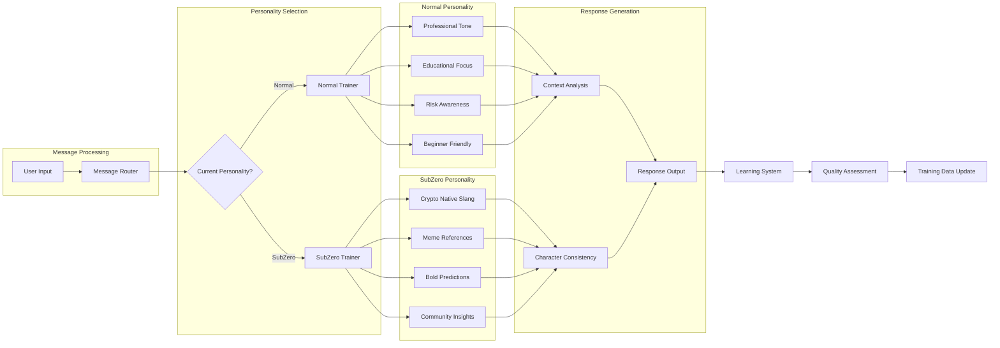

## 4. Training System Flow

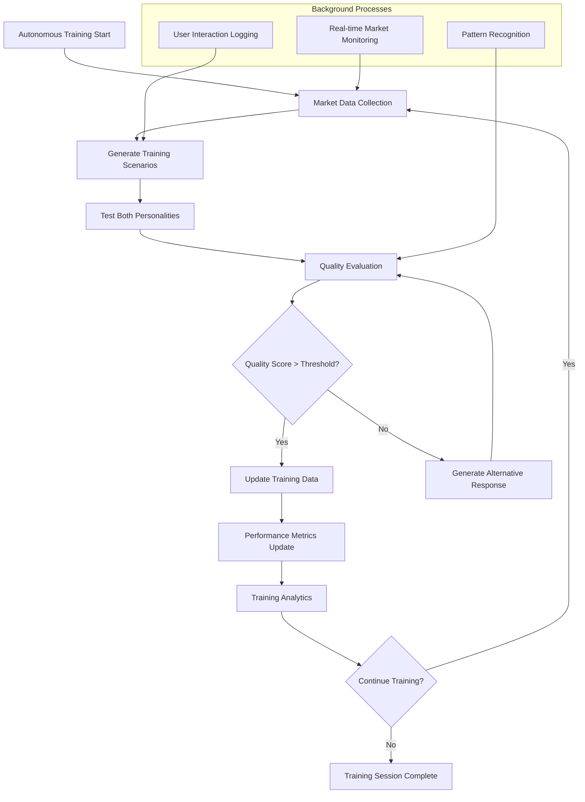

## 5. API Endpoint Structure

```mermaid
graph TB
    subgraph "Chat Endpoints"
        A1[POST /chat<br/>Send message to chatbot]
        A2[POST /chat/personality<br/>Switch personality mode]
        A3[GET /chat/history/{session_id}<br/>Retrieve conversation history]
    end
    
    subgraph "WebSocket Endpoints"
        B1[WS /ws/{session_id}<br/>Real-time chat connection]
    end
    
    subgraph "Management Endpoints"
        C1[GET /health<br/>Health check and system status]
        C2[GET /metrics<br/>Performance and usage metrics]
        C3[POST /admin/training/start<br/>Start autonomous training]
        C4[GET /admin/sessions<br/>Active session management]
    end
    
    subgraph "Widget Endpoints"
        D1[GET /widget<br/>Embeddable widget HTML]
        D2[GET /static/kointoss-widget.js<br/>Widget JavaScript]
        D3[GET /widget/config<br/>Widget configuration]
    end
    
    subgraph "Core Features"
        E[Session Management]
        F[Rate Limiting]
        G[CORS Protection]
        H[Input Validation]
    end
    
    A1 --> E
    A2 --> E
    A3 --> E
    B1 --> E
    A1 --> F
    B1 --> F
    A1 --> G
    B1 --> G
    A1 --> H
    A2 --> H
```

## 6. Data Flow Architecture

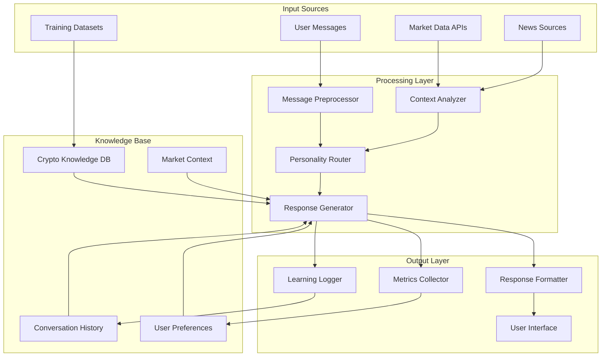

## 7. Deployment Architecture

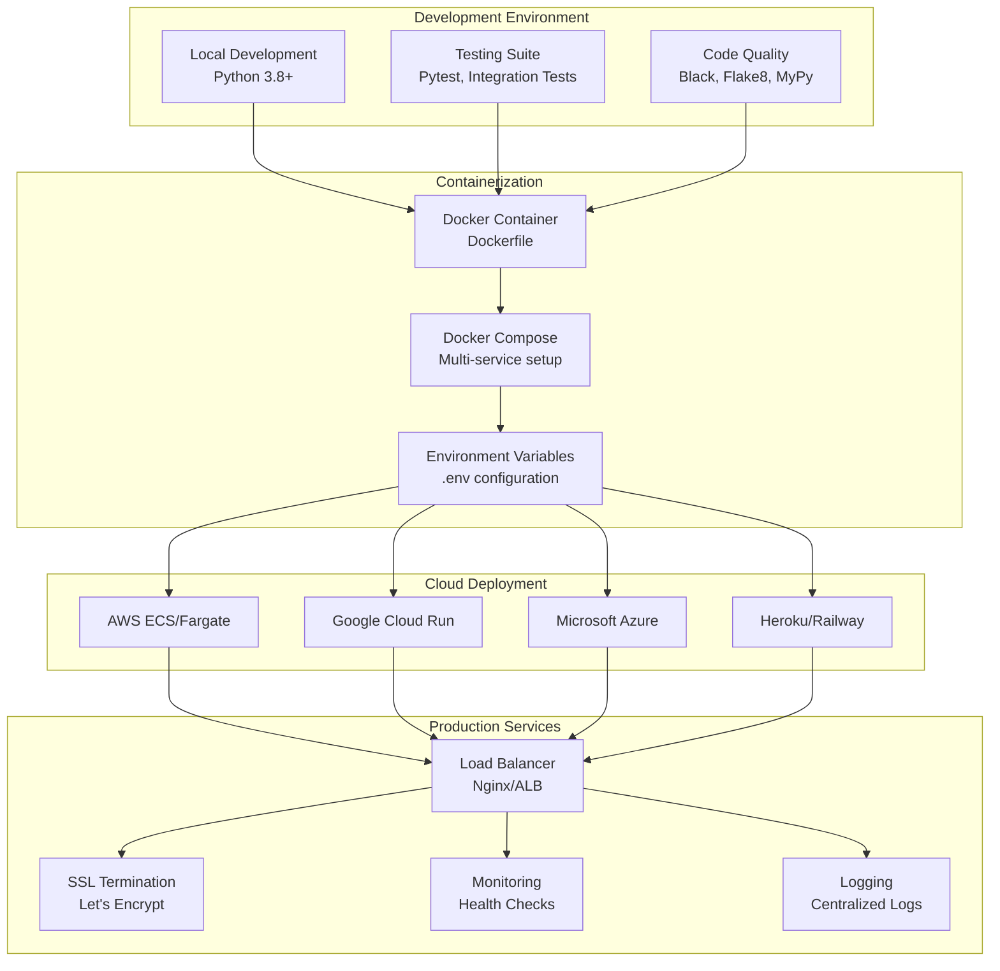

## 8. Security Architecture

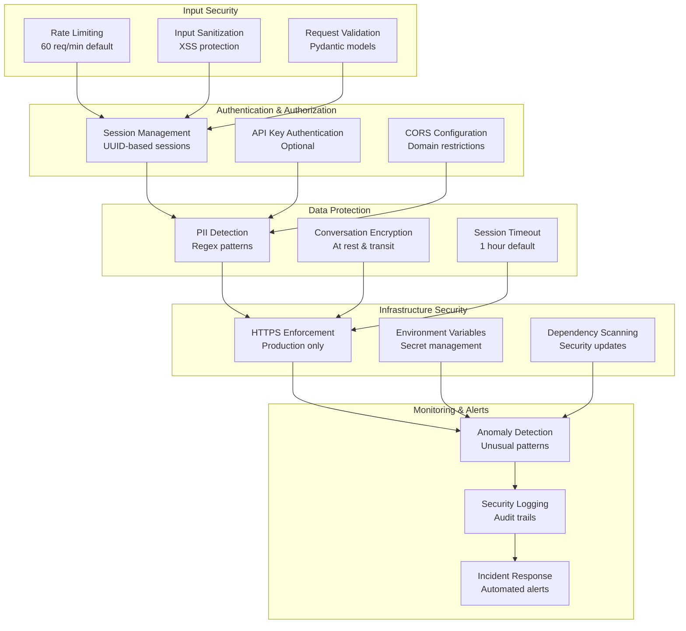

## 9. Performance Architecture

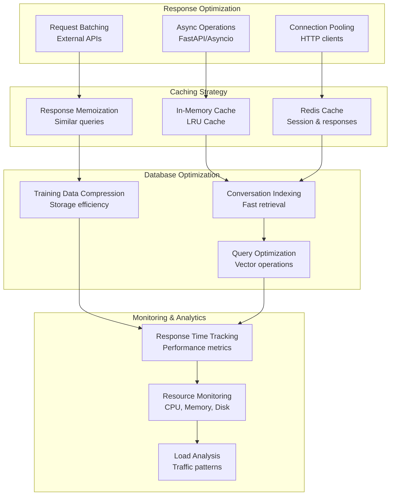

## 10. Use Case Diagram

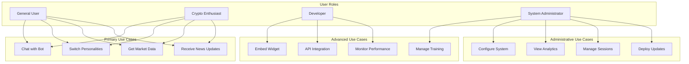

## 11. Error Handling Flow

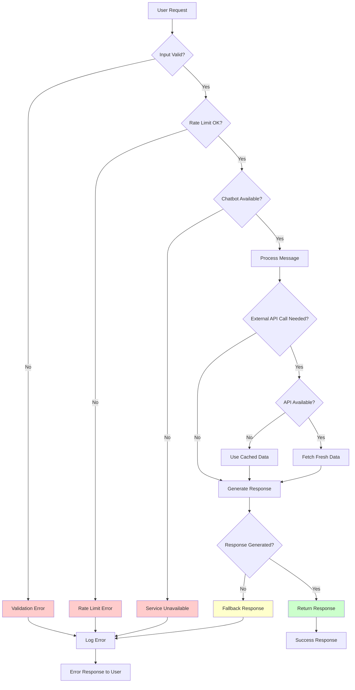

## 12. Training Data Pipeline

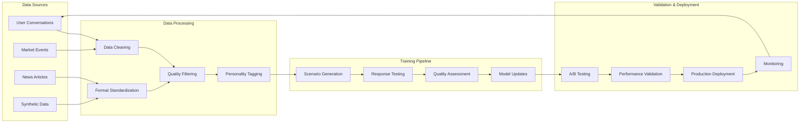

---

## Diagram Usage Instructions

### For Development Teams:
1. **System Architecture**: Use for understanding component relationships
2. **Request Flow**: Debug API interactions and performance bottlenecks
3. **Training System**: Optimize learning algorithms and data flow
4. **Security Architecture**: Implement security best practices

### For Deployment Teams:
1. **Deployment Architecture**: Plan cloud infrastructure and scaling
2. **Performance Architecture**: Optimize resource allocation and caching
3. **Error Handling Flow**: Design robust error recovery systems

### For Business Stakeholders:
1. **Use Case Diagram**: Understand user journeys and feature scope
2. **Dual Personality Architecture**: Visualize unique selling proposition
3. **API Endpoint Structure**: Plan integrations and partnerships

### Converting to Visual Diagrams:

These Mermaid diagrams can be rendered using:
- **GitHub/GitLab**: Native Mermaid support
- **Mermaid Live Editor**: https://mermaid.live
- **VS Code**: Mermaid Preview extension
- **Draw.io**: Import Mermaid syntax
- **Lucidchart**: Convert to professional diagrams
- **Confluence/Notion**: Embedded Mermaid support

### Exporting Options:
- **PNG/SVG**: For documentation and presentations
- **PDF**: For formal documentation
- **Interactive HTML**: For web-based documentation
- **Editable formats**: For further customization

---

*These diagrams represent the complete KoinToss system architecture as of December 2024. For the latest updates, refer to the main documentation.*
