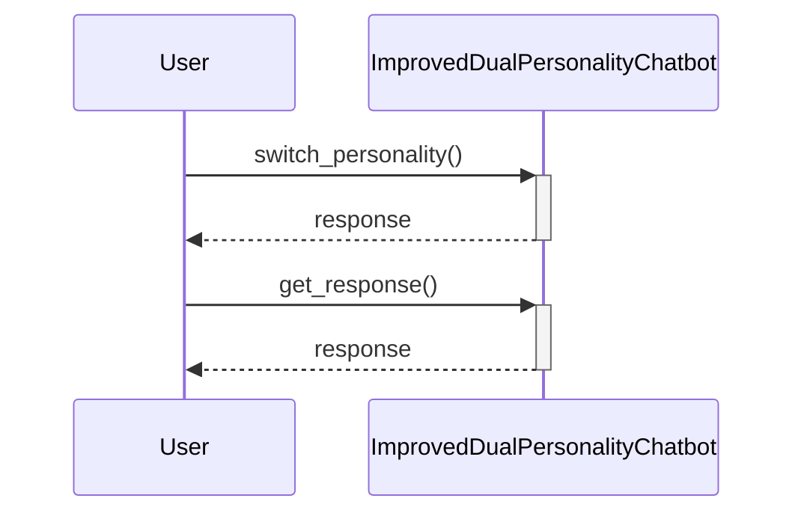

# KoinToss Code Analysis Report

## Project Overview
- **Total Python Files**: 123
- **Total Classes**: 28
- **Total Functions**: 266

## File Structure Diagram

```mermaid
graph TB
    subgraph "Core Chatbot"
        crypto_chatbot[crypto_chatbot.py]
        crypto_chatbot_fixed[crypto_chatbot_fixed.py]
        crypto_chatbot_fixed_subzero[crypto_chatbot_fixed_subzero.py]
        crypto_chatbot_simple[crypto_chatbot_simple.py]
        enhanced_crypto_chatbot[enhanced_crypto_chatbot.py]
        final_dual_personality_chatbot[final_dual_personality_chatbot.py]
        improved_dual_personality_chatbot[improved_dual_personality_chatbot.py]
        improved_dual_personality_chatbot_broken[improved_dual_personality_chatbot_broken.py]
        improved_dual_personality_chatbot_fixed[improved_dual_personality_chatbot_fixed.py]
        pure_dual_personality_chatbot[pure_dual_personality_chatbot.py]
        subzero_personality_adapter[subzero_personality_adapter.py]
    end
    subgraph "API Layer"
        api_server[api_server.py]
        api_utils[api_utils.py]
        enhanced_kointoss_api_server[enhanced_kointoss_api_server.py]
        kointoss_api_server[kointoss_api_server.py]
    end
    subgraph "Training System"
        advanced_autonomous_trainer[advanced_autonomous_trainer.py]
        advanced_subzero_trainer[advanced_subzero_trainer.py]
        advanced_subzero_trainer_fixed[advanced_subzero_trainer_fixed.py]
        advanced_training_system[advanced_training_system.py]
        autonomous_training_demo[autonomous_training_demo.py]
        autonomous_training_system[autonomous_training_system.py]
        comprehensive_bot_trainer[comprehensive_bot_trainer.py]
        continuous_learning_trainer[continuous_learning_trainer.py]
        continuous_learning_trainer_backup[continuous_learning_trainer_backup.py]
        continuous_training_demo[continuous_training_demo.py]
        conversation_trainer[conversation_trainer.py]
        dual_personality_intensive_trainer[dual_personality_intensive_trainer.py]
        enhanced_normal_trainer[enhanced_normal_trainer.py]
        enhanced_normal_trainer_backup[enhanced_normal_trainer_backup.py]
        enhanced_normal_trainer_corrupted[enhanced_normal_trainer_corrupted.py]
        enhanced_normal_trainer_fixed[enhanced_normal_trainer_fixed.py]
        enhanced_normal_trainer_v2[enhanced_normal_trainer_v2.py]
        normal_conversation_trainer[normal_conversation_trainer.py]
        pure_normal_trainer[pure_normal_trainer.py]
        pure_subzero_trainer[pure_subzero_trainer.py]
        pure_subzero_trainer_backup[pure_subzero_trainer_backup.py]
        simple_training_monitor[simple_training_monitor.py]
        start_autonomous_training[start_autonomous_training.py]
        subzero_conversation_trainer[subzero_conversation_trainer.py]
        training_analytics[training_analytics.py]
        training_demo[training_demo.py]
        training_monitor[training_monitor.py]
        training_orchestrator[training_orchestrator.py]
        verify_autonomous_training[verify_autonomous_training.py]
    end
    subgraph "Testing"
        compatibility_test[compatibility_test.py]
        comprehensive_final_test[comprehensive_final_test.py]
        comprehensive_sub_zero_test[comprehensive_sub_zero_test.py]
        comprehensive_test[comprehensive_test.py]
        file_test[file_test.py]
        final_integration_test[final_integration_test.py]
        final_sub_zero_test[final_sub_zero_test.py]
        minimal_strip_test[minimal_strip_test.py]
        production_verification_test[production_verification_test.py]
        quick_chatbot_test[quick_chatbot_test.py]
        quick_chatbot_test_fixed[quick_chatbot_test_fixed.py]
        quick_test[quick_test.py]
        simple_chatbot_test[simple_chatbot_test.py]
        simple_integration_test[simple_integration_test.py]
        simple_subzero_test[simple_subzero_test.py]
        simple_sub_zero_test[simple_sub_zero_test.py]
        simple_sub_zero_test_no_torch[simple_sub_zero_test_no_torch.py]
        simple_test_debug[simple_test_debug.py]
        test_ai[test_ai.py]
        test_api_integration[test_api_integration.py]
        test_article_insights[test_article_insights.py]
        test_basic_components[test_basic_components.py]
        test_chatbot_with_news[test_chatbot_with_news.py]
        test_continuous_learning[test_continuous_learning.py]
        test_core_components[test_core_components.py]
        test_core_components_backup[test_core_components_backup.py]
        test_doge_fix[test_doge_fix.py]
        test_enhanced_bot[test_enhanced_bot.py]
        test_enhanced_bot_v2[test_enhanced_bot_v2.py]
        test_enhanced_features[test_enhanced_features.py]
        test_import_only[test_import_only.py]
        test_improved_chatbot[test_improved_chatbot.py]
        test_individual_imports[test_individual_imports.py]
        test_kointoss_app[test_kointoss_app.py]
        test_personality_fix[test_personality_fix.py]
        test_pi_detection[test_pi_detection.py]
        test_pure_chatbot[test_pure_chatbot.py]
        test_response_format[test_response_format.py]
        test_simplified_chatbot[test_simplified_chatbot.py]
        test_specific_responses[test_specific_responses.py]
        test_streamlit_deps[test_streamlit_deps.py]
        test_streamlit_integration[test_streamlit_integration.py]
        test_subzero_integration[test_subzero_integration.py]
        test_sub_zero_fix[test_sub_zero_fix.py]
        test_user_scenario[test_user_scenario.py]
        timeout_test[timeout_test.py]
    end
```


## Class Relationships

```mermaid
classDiagram
    class AdvancedAutonomousTrainer {
        -__init__(self, chatbot)
        +initialize_dynamic_scenarios(self)
        +fetch_real_time_data(self)
        +analyze_market_sentiment(self, market_data)
        +generate_contextual_training_data(self, real_time_data)
        +self_evaluate_response(self, question, response)
        +continuous_learning_cycle(self)
        +analyze_learning_progress(self)
        +adapt_training_parameters(self)
        +start_autonomous_training(self)
        +stop_autonomous_training(self)
        +get_training_statistics(self)
        +export_training_data(self, filename)
    }
    class AdvancedTrainingSystem {
        -__init__(self, chatbot_instance)
        +start_background_training(self)
        +stop_background_training(self)
        -_background_training_loop(self)
        +record_interaction(self, user_input, bot_response, confidence, response_type, personality, feedback_score)
        +assess_interaction_quality(self, interaction)
        +collect_user_feedback(self, interaction_index, satisfaction_rating, specific_feedback)
        +train_from_interactions(self)
        +save_training_session(self, training_data)
        +optimize_trainer_parameters(self)
        +get_success_rate(self)
        +get_training_statistics(self)
        +manual_training_cycle(self)
    }
    class CryptoAPIs {
        -__init__(self)
        +initialize_apis(self)
        +get_markets_data(self)
        +get_coin_price(self, coin_id)
    }
    class AutonomousTrainingSystem {
        -__init__(self, chatbot)
        +generate_training_scenarios(self)
        +start_autonomous_training(self)
        +stop_autonomous_training(self)
        -_training_loop(self)
        -_run_training_session(self)
        -_evaluate_response_quality(self, question, response, expected_quality)
        -_attempt_improvement(self, question, response, personality, expected_quality)
        -_generate_question_variations(self, question)
        -_measure_accuracy(self)
        -_save_training_progress(self)
        +get_training_status(self)
        +get_improvement_recommendations(self)
        +record_interaction(self, user_input, bot_response, confidence, response_type, personality)
        +get_training_statistics(self)
        +get_recent_activities(self)
        +run_single_training_iteration(self)
    }
    class CodeAnalyzer {
        -__init__(self, project_root)
        +scan_project(self)
        +analyze_file(self, file_path)
        +analyze_class(self, node)
        +analyze_function(self, node)
        +analyze_import(self, node)
        +generate_class_diagram_mermaid(self)
        +generate_dependency_graph_mermaid(self)
        +generate_file_structure_mermaid(self)
        +generate_call_flow_diagram(self, entry_point)
        +export_analysis_report(self, output_file)
    }
    class CryptoNewsInsights {
        -__init__(self)
        +get_latest_news(self, topic, limit)
        -_fetch_coingecko_news(self, topic, limit)
        -_get_mock_news(self, topic, limit)
        +analyze_sentiment(self, text)
        +get_market_insights(self, personality)
        -_generate_enhanced_normal_insights(self, articles, strong_bull, mod_bull, weak_bull, strong_bear, mod_bear, weak_bear, neutral, tech_factors, fund_factors)
        -_generate_enhanced_subzero_insights(self, articles, strong_bull, mod_bull, weak_bull, strong_bear, mod_bear, weak_bear, neutral, tech_factors, fund_factors)
        +get_specific_coin_news(self, coin, personality)
    }
    class DualPersonalityAdvancedTrainer {
        -__init__(self, chatbot)
        +create_normal_personality_scenarios(self)
        +create_subzero_personality_scenarios(self)
        +create_shared_scenarios(self)
        +fetch_enhanced_market_data(self)
        +analyze_market_conditions(self, market_data)
        +generate_personality_specific_training(self, personality, market_data)
        +evaluate_personality_response(self, question, response, expected_personality)
        +cross_personality_training_cycle(self)
        +intensive_dual_training_cycle(self)
        +calculate_learning_velocities(self)
        +report_training_progress(self, cycle_count)
        +start_intensive_training(self)
        +stop_training(self)
        +get_comprehensive_stats(self)
        +export_dual_training_data(self, filename)
    }
    class SessionManager {
        -__init__(self)
        +create_session(self, session_id)
        +get_session(self, session_id)
        +update_session(self, session_id, data)
        +cleanup_expired_sessions(self)
    }
    class RateLimiter {
        -__init__(self)
        +is_allowed(self, client_id)
    }
    class ChatRequest {
    }
    BaseModel <|-- ChatRequest
    class ChatResponse {
    }
    BaseModel <|-- ChatResponse
    class PersonalityRequest {
    }
    BaseModel <|-- PersonalityRequest
    class SessionInfo {
    }
    BaseModel <|-- SessionInfo
    class ConnectionManager {
        -__init__(self)
        +disconnect(self, websocket)
    }
    class PureNormalTrainer {
        -__init__(self, dataset_file)
        +load_dataset(self)
        +tokenize_text(self, text)
        +text_to_vector(self, text)
        +cosine_similarity_custom(self, vec1, vec2)
        +build_similarity_model(self)
        +try_keyword_matching(self, user_input)
        +get_real_time_price(self, coin_name)
        +get_coin_information(self, coin_name)
        +find_best_response(self, user_input, threshold)
        +get_smart_fallback(self, user_input)
        +get_response(self, user_input)
        +get_training_info(self)
    }
    class PureNormalTrainer {
        -__init__(self, dataset_file)
        +load_dataset(self)
        +tokenize_text(self, text)
        +text_to_vector(self, text)
        +cosine_similarity_custom(self, vec1, vec2)
        +build_similarity_model(self)
        +try_keyword_matching(self, user_input)
        +get_real_time_price(self, coin_name)
        +get_coin_information(self, coin_name)
        +find_best_response(self, user_input, threshold)
        +get_smart_fallback(self, user_input)
        +get_response(self, user_input)
        +get_training_info(self)
    }
    class ImprovedDualPersonalityChatbot {
        -__init__(self)
        +initialize_trainers(self)
        +initialize_news_service(self)
        +switch_personality(self, mode)
        +get_crypto_news_context(self, user_input)
        +get_response(self, user_input)
        +get_system_info(self)
        +get_conversation_history(self)
        +clear_history(self)
        +get_learning_statistics(self)
    }
    class ImprovedDualPersonalityChatbot {
        -__init__(self)
        +initialize_trainers(self)
        +initialize_news_service(self)
        +switch_personality(self, mode)
        +get_crypto_news_context(self, user_input)
        +get_response(self, user_input)
        +get_system_info(self)
        +get_conversation_history(self)
        +clear_history(self)
        +get_learning_statistics(self)
    }
    class ChatRequest {
    }
    BaseModel <|-- ChatRequest
    class ChatResponse {
    }
    BaseModel <|-- ChatResponse
    class PersonalityRequest {
    }
    BaseModel <|-- PersonalityRequest
    class KoinTossProductionTest {
        -__init__(self)
        +test_chatbot_core(self)
        +test_autonomous_training(self)
        +test_api_imports(self)
        +test_data_sources(self)
        +test_training_functionality(self)
        +test_file_integrity(self)
        +run_all_tests(self)
    }
    class PureNormalTrainer {
        -__init__(self, dataset_file)
        +load_dataset(self)
        +load_json_dataset(self)
        +load_text_dataset(self)
        +build_similarity_model(self)
        +find_best_response(self, user_input, threshold)
        +get_training_stats(self)
    }
    class PureSubZeroTrainer {
        -__init__(self, dataset_file)
        +tokenize_text(self, text)
        +text_to_vector(self, text)
        +cosine_similarity_custom(self, vec1, vec2)
        +load_dataset(self)
        +build_similarity_model(self)
        +find_best_response(self, user_input, threshold)
        +get_subzero_fallback(self, user_input)
        +get_response(self, user_input)
        +get_training_info(self)
    }
    class PureSubZeroTrainer {
        -__init__(self, dataset_file)
        +load_dataset(self)
        +build_similarity_model(self)
        +get_response(self, user_input, threshold)
        +get_training_stats(self)
    }
    class TrainingAnalytics {
        -__init__(self)
        +load_training_history(self)
        +analyze_training_progress(self)
        +analyze_conversation_patterns(self)
        +generate_training_report(self)
        +save_analytics_report(self, filename)
        +visualize_training_progress(self)
    }
    class SimpleTrainingDemo {
        -__init__(self)
        +start_training_demo(self, duration_minutes)
        -_run_training_cycle(self, scenarios)
        -_estimate_quality(self, question, response, category)
        -_show_current_stats(self, stage)
        -_show_improvement_summary(self)
    }
    class TrainingOrchestrator {
        -__init__(self)
        +register_training_system(self, name, system)
        +start_orchestrated_training(self)
        +continuous_analytics(self)
        +collect_performance_data(self)
        +analyze_performance_trends(self)
        +generate_optimization_recommendations(self, trends)
        +display_analytics_insights(self, performance, trends, recommendations)
        +apply_auto_optimizations(self, recommendations)
        +generate_comprehensive_report(self)
        +stop_orchestrated_training(self)
    }
```


## Dependency Graph
```mermaid
graph TD
    advanced_autonomous_trainer[advanced_autonomous_trainer]
    advanced_subzero_trainer[advanced_subzero_trainer]
    advanced_subzero_trainer_fixed[advanced_subzero_trainer_fixed]
    advanced_training_system[advanced_training_system]
    api_server[api_server]
    api_utils[api_utils]
    argparse[argparse]
    article_manager[article_manager]
    ast[ast]
    asyncio[asyncio]
    autonomous_training_demo[autonomous_training_demo]
    autonomous_training_system[autonomous_training_system]
    cleanup_repository[cleanup_repository]
    code_diagram_generator[code_diagram_generator]
    compatibility_test[compatibility_test]
    comprehensive_bot_trainer[comprehensive_bot_trainer]
    comprehensive_demo[comprehensive_demo]
    comprehensive_final_test[comprehensive_final_test]
    comprehensive_sub_zero_test[comprehensive_sub_zero_test]
    comprehensive_test[comprehensive_test]
    continuous_learning_trainer[continuous_learning_trainer]
    continuous_training_demo[continuous_training_demo]
    conversation_trainer[conversation_trainer]
    crypto_chatbot[crypto_chatbot]
    crypto_chatbot_fixed[crypto_chatbot_fixed]
    crypto_chatbot_fixed_subzero[crypto_chatbot_fixed_subzero]
    crypto_chatbot_simple[crypto_chatbot_simple]
    crypto_news_insights[crypto_news_insights]
    datetime[datetime]
    debug_exact_issue[debug_exact_issue]
    debug_greeting[debug_greeting]
    debug_strip_error[debug_strip_error]
    demo_bot[demo_bot]
    download_dailydialog[download_dailydialog]
    dual_personality_intensive_trainer[dual_personality_intensive_trainer]
    enhanced_crypto_chatbot[enhanced_crypto_chatbot]
    enhanced_kointoss_api_server[enhanced_kointoss_api_server]
    enhanced_normal_trainer[enhanced_normal_trainer]
    enhanced_normal_trainer_fixed[enhanced_normal_trainer_fixed]
    enhanced_normal_trainer_v2[enhanced_normal_trainer_v2]
    enhanced_subzero_generator[enhanced_subzero_generator]
    execute_cleanup[execute_cleanup]
    fastapi[fastapi]
    fastapi_middleware_cors[fastapi.middleware.cors]
    fastapi_responses[fastapi.responses]
    fastapi_security[fastapi.security]
    fastapi_staticfiles[fastapi.staticfiles]
    file_test[file_test]
    final_dual_personality_chatbot[final_dual_personality_chatbot]
    final_integration_test[final_integration_test]
    final_sub_zero_test[final_sub_zero_test]
    final_system_verification[final_system_verification]
    final_verification[final_verification]
    final_verification_complete[final_verification_complete]
    fix_greeting_debug[fix_greeting_debug]
    full_implementation_check[full_implementation_check]
    generate_subzero_dataset[generate_subzero_dataset]
    glob[glob]
    iframe_app[iframe_app]
    improved_dual_personality_chatbot[improved_dual_personality_chatbot]
    improved_dual_personality_chatbot_fixed[improved_dual_personality_chatbot_fixed]
    interactive_demo[interactive_demo]
    json[json]
    kointoss_api_server[kointoss_api_server]
    kointoss_streamlit_app[kointoss_streamlit_app]
    kucoin_client[kucoin.client]
    learning_capabilities_demo[learning_capabilities_demo]
    logging[logging]
    massive_subzero_generator[massive_subzero_generator]
    math[math]
    matplotlib_dates[matplotlib.dates]
    matplotlib_pyplot[matplotlib.pyplot]
    minimal_strip_test[minimal_strip_test]
    normal_conversation_trainer[normal_conversation_trainer]
    numpy[numpy]
    os[os]
    pandas[pandas]
    pathlib[pathlib]
    pickle[pickle]
    plotly_graph_objects[plotly.graph_objects]
    production_validation[production_validation]
    production_verification_test[production_verification_test]
    pure_dual_personality_chatbot[pure_dual_personality_chatbot]
    pure_normal_trainer[pure_normal_trainer]
    pure_subzero_trainer[pure_subzero_trainer]
    pure_subzero_trainer_backup[pure_subzero_trainer_backup]
    pycoingecko[pycoingecko]
    pydantic[pydantic]
    quick_chatbot_test_fixed[quick_chatbot_test_fixed]
    quick_demo[quick_demo]
    quick_test[quick_test]
    random[random]
    re[re]
    requests[requests]
    setup[setup]
    setuptools[setuptools]
    signal[signal]
    simple_chatbot_test[simple_chatbot_test]
    simple_integration_test[simple_integration_test]
    simple_sub_zero_test[simple_sub_zero_test]
    simple_sub_zero_test_no_torch[simple_sub_zero_test_no_torch]
    simple_subzero_test[simple_subzero_test]
    simple_test_debug[simple_test_debug]
    simple_training_monitor[simple_training_monitor]
    sklearn_feature_extraction_text[sklearn.feature_extraction.text]
    sklearn_metrics_pairwise[sklearn.metrics.pairwise]
    start_autonomous_training[start_autonomous_training]
    streamlit[streamlit]
    subzero_conversation_trainer[subzero_conversation_trainer]
    subzero_demo[subzero_demo]
    subzero_personality_adapter[subzero_personality_adapter]
    sys[sys]
    test_ai[test_ai]
    test_api_integration[test_api_integration]
    test_article_insights[test_article_insights]
    test_basic_components[test_basic_components]
    test_chatbot_with_news[test_chatbot_with_news]
    test_continuous_learning[test_continuous_learning]
    test_core_components[test_core_components]
    test_core_components_backup[test_core_components_backup]
    test_doge_fix[test_doge_fix]
    test_enhanced_bot[test_enhanced_bot]
    test_enhanced_bot_v2[test_enhanced_bot_v2]
    test_enhanced_features[test_enhanced_features]
    test_import_only[test_import_only]
    test_improved_chatbot[test_improved_chatbot]
    test_individual_imports[test_individual_imports]
    test_kointoss_app[test_kointoss_app]
    test_personality_fix[test_personality_fix]
    test_pi_detection[test_pi_detection]
    test_pure_chatbot[test_pure_chatbot]
    test_response_format[test_response_format]
    test_simplified_chatbot[test_simplified_chatbot]
    test_specific_responses[test_specific_responses]
    test_streamlit_deps[test_streamlit_deps]
    test_streamlit_integration[test_streamlit_integration]
    test_sub_zero_fix[test_sub_zero_fix]
    test_subzero_integration[test_subzero_integration]
    test_user_scenario[test_user_scenario]
    threading[threading]
    time[time]
    timeout_test[timeout_test]
    traceback[traceback]
    training_analytics[training_analytics]
    training_demo[training_demo]
    training_monitor[training_monitor]
    training_orchestrator[training_orchestrator]
    typing[typing]
    uuid[uuid]
    uvicorn[uvicorn]
    vaderSentiment_vaderSentiment[vaderSentiment.vaderSentiment]
    validate_integration[validate_integration]
    validate_subzero[validate_subzero]
    verify_autonomous_training[verify_autonomous_training]
    verify_deployment_ready[verify_deployment_ready]
    advanced_autonomous_trainer --> datetime
    advanced_autonomous_trainer --> improved_dual_personality_chatbot
    advanced_autonomous_trainer --> json
    advanced_autonomous_trainer --> numpy
    advanced_autonomous_trainer --> random
    advanced_autonomous_trainer --> requests
    advanced_autonomous_trainer --> threading
    advanced_autonomous_trainer --> time
    advanced_autonomous_trainer --> traceback
    advanced_autonomous_trainer --> typing
    advanced_training_system --> datetime
    advanced_training_system --> json
    advanced_training_system --> math
    advanced_training_system --> numpy
    advanced_training_system --> pickle
    advanced_training_system --> random
    advanced_training_system --> re
    advanced_training_system --> threading
    advanced_training_system --> time
    advanced_training_system --> typing
    api_utils --> kucoin_client
    api_utils --> logging
    api_utils --> pycoingecko
    api_utils --> requests
    api_utils --> time
    autonomous_training_demo --> glob
    autonomous_training_demo --> improved_dual_personality_chatbot
    autonomous_training_demo --> json
    autonomous_training_demo --> os
    autonomous_training_demo --> sys
    autonomous_training_demo --> time
    autonomous_training_demo --> traceback
    autonomous_training_system --> datetime
    autonomous_training_system --> improved_dual_personality_chatbot
    autonomous_training_system --> json
    autonomous_training_system --> numpy
    autonomous_training_system --> random
    autonomous_training_system --> threading
    autonomous_training_system --> time
    autonomous_training_system --> typing
    code_diagram_generator --> ast
    code_diagram_generator --> json
    code_diagram_generator --> os
    code_diagram_generator --> pathlib
    code_diagram_generator --> re
    code_diagram_generator --> typing
    continuous_training_demo --> improved_dual_personality_chatbot
    continuous_training_demo --> random
    continuous_training_demo --> time
    crypto_news_insights --> datetime
    crypto_news_insights --> json
    crypto_news_insights --> re
    crypto_news_insights --> requests
    crypto_news_insights --> time
    crypto_news_insights --> typing
    debug_strip_error --> improved_dual_personality_chatbot
    debug_strip_error --> traceback
    dual_personality_intensive_trainer --> datetime
    dual_personality_intensive_trainer --> improved_dual_personality_chatbot
    dual_personality_intensive_trainer --> json
    dual_personality_intensive_trainer --> numpy
    dual_personality_intensive_trainer --> random
    dual_personality_intensive_trainer --> requests
    dual_personality_intensive_trainer --> threading
    dual_personality_intensive_trainer --> time
    dual_personality_intensive_trainer --> traceback
    dual_personality_intensive_trainer --> typing
    enhanced_kointoss_api_server --> advanced_autonomous_trainer
    enhanced_kointoss_api_server --> argparse
    enhanced_kointoss_api_server --> asyncio
    enhanced_kointoss_api_server --> datetime
    enhanced_kointoss_api_server --> fastapi
    enhanced_kointoss_api_server --> fastapi_middleware_cors
    enhanced_kointoss_api_server --> fastapi_responses
    enhanced_kointoss_api_server --> fastapi_security
    enhanced_kointoss_api_server --> improved_dual_personality_chatbot
    enhanced_kointoss_api_server --> json
    enhanced_kointoss_api_server --> logging
    enhanced_kointoss_api_server --> pydantic
    enhanced_kointoss_api_server --> time
    enhanced_kointoss_api_server --> typing
    enhanced_kointoss_api_server --> uuid
    enhanced_kointoss_api_server --> uvicorn
    enhanced_normal_trainer --> api_utils
    enhanced_normal_trainer --> json
    enhanced_normal_trainer --> math
    enhanced_normal_trainer --> numpy
    enhanced_normal_trainer --> random
    enhanced_normal_trainer --> re
    enhanced_normal_trainer --> typing
    enhanced_normal_trainer_fixed --> api_utils
    enhanced_normal_trainer_fixed --> json
    enhanced_normal_trainer_fixed --> math
    enhanced_normal_trainer_fixed --> numpy
    enhanced_normal_trainer_fixed --> random
    enhanced_normal_trainer_fixed --> re
    enhanced_normal_trainer_fixed --> typing
    final_system_verification --> api_utils
    final_system_verification --> autonomous_training_system
    final_system_verification --> datetime
    final_system_verification --> enhanced_normal_trainer
    final_system_verification --> improved_dual_personality_chatbot
    final_system_verification --> os
    final_system_verification --> pure_subzero_trainer
    final_system_verification --> streamlit
    final_system_verification --> sys
    final_verification --> api_utils
    final_verification --> autonomous_training_system
    final_verification --> continuous_learning_trainer
    final_verification --> datetime
    final_verification --> enhanced_normal_trainer
    final_verification --> improved_dual_personality_chatbot
    final_verification --> json
    final_verification --> os
    final_verification --> pure_subzero_trainer
    final_verification --> streamlit
    final_verification --> sys
    final_verification --> time
    final_verification_complete --> api_utils
    final_verification_complete --> enhanced_normal_trainer
    final_verification_complete --> improved_dual_personality_chatbot
    final_verification_complete --> pure_subzero_trainer
    final_verification_complete --> traceback
    full_implementation_check --> continuous_learning_trainer
    full_implementation_check --> glob
    full_implementation_check --> improved_dual_personality_chatbot
    full_implementation_check --> os
    full_implementation_check --> sys
    full_implementation_check --> traceback
    improved_dual_personality_chatbot --> crypto_news_insights
    improved_dual_personality_chatbot --> datetime
    improved_dual_personality_chatbot --> enhanced_normal_trainer
    improved_dual_personality_chatbot --> json
    improved_dual_personality_chatbot --> pure_subzero_trainer
    improved_dual_personality_chatbot --> random
    improved_dual_personality_chatbot --> re
    improved_dual_personality_chatbot --> typing
    improved_dual_personality_chatbot_fixed --> crypto_news_insights
    improved_dual_personality_chatbot_fixed --> datetime
    improved_dual_personality_chatbot_fixed --> enhanced_normal_trainer
    improved_dual_personality_chatbot_fixed --> json
    improved_dual_personality_chatbot_fixed --> pure_subzero_trainer
    improved_dual_personality_chatbot_fixed --> random
    improved_dual_personality_chatbot_fixed --> re
    improved_dual_personality_chatbot_fixed --> typing
    kointoss_api_server --> fastapi
    kointoss_api_server --> fastapi_middleware_cors
    kointoss_api_server --> fastapi_responses
    kointoss_api_server --> fastapi_staticfiles
    kointoss_api_server --> improved_dual_personality_chatbot
    kointoss_api_server --> json
    kointoss_api_server --> pydantic
    kointoss_api_server --> typing
    kointoss_api_server --> uvicorn
    kointoss_streamlit_app --> datetime
    kointoss_streamlit_app --> improved_dual_personality_chatbot
    kointoss_streamlit_app --> json
    kointoss_streamlit_app --> streamlit
    kointoss_streamlit_app --> time
    learning_capabilities_demo --> glob
    learning_capabilities_demo --> improved_dual_personality_chatbot
    learning_capabilities_demo --> os
    learning_capabilities_demo --> sys
    learning_capabilities_demo --> traceback
    minimal_strip_test --> improved_dual_personality_chatbot
    minimal_strip_test --> traceback
    production_verification_test --> advanced_autonomous_trainer
    production_verification_test --> datetime
    production_verification_test --> enhanced_kointoss_api_server
    production_verification_test --> fastapi
    production_verification_test --> fastapi_middleware_cors
    production_verification_test --> improved_dual_personality_chatbot
    production_verification_test --> json
    production_verification_test --> os
    production_verification_test --> pydantic
    production_verification_test --> requests
    production_verification_test --> threading
    production_verification_test --> time
    production_verification_test --> uvicorn
    pure_normal_trainer --> json
    pure_normal_trainer --> numpy
    pure_normal_trainer --> random
    pure_normal_trainer --> re
    pure_normal_trainer --> sklearn_feature_extraction_text
    pure_normal_trainer --> sklearn_metrics_pairwise
    pure_normal_trainer --> typing
    pure_subzero_trainer --> json
    pure_subzero_trainer --> math
    pure_subzero_trainer --> numpy
    pure_subzero_trainer --> random
    pure_subzero_trainer --> re
    pure_subzero_trainer --> typing
    pure_subzero_trainer_backup --> json
    pure_subzero_trainer_backup --> math
    pure_subzero_trainer_backup --> numpy
    pure_subzero_trainer_backup --> random
    pure_subzero_trainer_backup --> re
    pure_subzero_trainer_backup --> typing
    quick_chatbot_test_fixed --> improved_dual_personality_chatbot
    quick_chatbot_test_fixed --> traceback
    quick_demo --> improved_dual_personality_chatbot
    quick_demo --> os
    quick_demo --> sys
    quick_demo --> traceback
    quick_test --> autonomous_training_system
    quick_test --> continuous_learning_trainer
    quick_test --> improved_dual_personality_chatbot
    quick_test --> os
    quick_test --> sys
    quick_test --> traceback
    setup --> os
    setup --> setuptools
    simple_chatbot_test --> improved_dual_personality_chatbot
    simple_chatbot_test --> traceback
    simple_training_monitor --> datetime
    simple_training_monitor --> improved_dual_personality_chatbot
    start_autonomous_training --> advanced_autonomous_trainer
    start_autonomous_training --> asyncio
    start_autonomous_training --> datetime
    start_autonomous_training --> improved_dual_personality_chatbot
    start_autonomous_training --> signal
    start_autonomous_training --> sys
    start_autonomous_training --> threading
    start_autonomous_training --> time
    test_api_integration --> api_utils
    test_api_integration --> enhanced_normal_trainer
    test_api_integration --> traceback
    test_basic_components --> crypto_news_insights
    test_basic_components --> enhanced_normal_trainer
    test_basic_components --> os
    test_basic_components --> pure_subzero_trainer
    test_basic_components --> sys
    test_basic_components --> traceback
    test_continuous_learning --> autonomous_training_system
    test_continuous_learning --> continuous_learning_trainer
    test_continuous_learning --> glob
    test_continuous_learning --> improved_dual_personality_chatbot
    test_continuous_learning --> json
    test_continuous_learning --> os
    test_continuous_learning --> sys
    test_continuous_learning --> time
    test_continuous_learning --> traceback
    test_core_components --> crypto_news_insights
    test_core_components --> enhanced_normal_trainer
    test_core_components --> pure_subzero_trainer
    test_core_components --> traceback
    test_core_components_backup --> crypto_news_insights
    test_core_components_backup --> enhanced_normal_trainer
    test_core_components_backup --> pure_subzero_trainer
    test_core_components_backup --> traceback
    test_doge_fix --> improved_dual_personality_chatbot
    test_doge_fix --> traceback
    test_enhanced_bot --> improved_dual_personality_chatbot
    test_enhanced_bot --> time
    test_enhanced_features --> datetime
    test_enhanced_features --> improved_dual_personality_chatbot
    test_enhanced_features --> json
    test_enhanced_features --> traceback
    test_kointoss_app --> kointoss_streamlit_app
    test_kointoss_app --> traceback
    test_personality_fix --> improved_dual_personality_chatbot
    test_personality_fix --> traceback
    test_pi_detection --> api_utils
    test_pi_detection --> enhanced_normal_trainer
    test_pi_detection --> sys
    test_pi_detection --> traceback
    test_response_format --> improved_dual_personality_chatbot
    test_response_format --> traceback
    test_streamlit_deps --> api_utils
    test_streamlit_deps --> datetime
    test_streamlit_deps --> improved_dual_personality_chatbot
    test_streamlit_deps --> pandas
    test_streamlit_deps --> plotly_graph_objects
    test_streamlit_deps --> re
    test_streamlit_deps --> requests
    test_streamlit_deps --> streamlit
    test_streamlit_deps --> time
    test_streamlit_deps --> traceback
    test_streamlit_deps --> vaderSentiment_vaderSentiment
    test_user_scenario --> improved_dual_personality_chatbot
    test_user_scenario --> traceback
    training_analytics --> datetime
    training_analytics --> glob
    training_analytics --> json
    training_analytics --> matplotlib_dates
    training_analytics --> matplotlib_pyplot
    training_analytics --> numpy
    training_analytics --> os
    training_analytics --> time
    training_analytics --> typing
    training_demo --> datetime
    training_demo --> improved_dual_personality_chatbot
    training_demo --> random
    training_demo --> sys
    training_demo --> threading
    training_demo --> time
    training_monitor --> datetime
    training_monitor --> json
    training_monitor --> os
    training_monitor --> time
    training_orchestrator --> asyncio
    training_orchestrator --> datetime
    training_orchestrator --> json
    training_orchestrator --> numpy
    training_orchestrator --> signal
    training_orchestrator --> sys
    training_orchestrator --> threading
    training_orchestrator --> time
    training_orchestrator --> traceback
    training_orchestrator --> typing
    verify_autonomous_training --> os
    verify_deployment_ready --> crypto_news_insights
    verify_deployment_ready --> enhanced_normal_trainer
    verify_deployment_ready --> json
    verify_deployment_ready --> pure_subzero_trainer
    verify_deployment_ready --> sys
```

## Call Flow Diagram


## Detailed Analysis

### advanced_autonomous_trainer.py
**Classes:**
- `AdvancedAutonomousTrainer`
  - Methods: 13
  - Attributes: 0
**Functions:**
- `__init__()`
- `initialize_dynamic_scenarios()`
  - Initialize dynamic training scenarios that adapt to market conditions...
- `fetch_real_time_data()`
  - Fetch real-time crypto data for training context...
- `analyze_market_sentiment()`
  - Analyze overall market sentiment from price data...
- `generate_contextual_training_data()`
  - Generate training scenarios based on current market conditions...
- `self_evaluate_response()`
  - Evaluate the quality of a chatbot response...
- `continuous_learning_cycle()`
  - Main continuous learning loop...
- `analyze_learning_progress()`
  - Analyze learning progress and identify improvement areas...
- `adapt_training_parameters()`
  - Dynamically adjust training parameters based on performance...
- `start_autonomous_training()`
  - Start the autonomous training process...
- `stop_autonomous_training()`
  - Stop the autonomous training process...
- `get_training_statistics()`
  - Get comprehensive training statistics...
- `export_training_data()`
  - Export training data and metrics to file...
**Key Dependencies:**
- json
- time
- random
- threading
- requests

### advanced_subzero_trainer.py

### advanced_subzero_trainer_fixed.py

### advanced_training_system.py
**Classes:**
- `AdvancedTrainingSystem`
  - Methods: 13
  - Attributes: 0
**Functions:**
- `test_advanced_training()`
  - Test the advanced training system...
- `__init__()`
- `start_background_training()`
  - Start background training thread for continuous improvement...
- `stop_background_training()`
  - Stop background training system...
- `_background_training_loop()`
  - Background loop for continuous training...
- `record_interaction()`
  - Record a conversation interaction for learning...
- `assess_interaction_quality()`
  - Assess the quality of an interaction for learning...
- `collect_user_feedback()`
  - Collect user feedback for a specific interaction...
- `train_from_interactions()`
  - Train the model from recent interactions...
- `save_training_session()`
  - Save training session data for analysis...
- `optimize_trainer_parameters()`
  - Optimize trainer parameters based on performance metrics...
- `get_success_rate()`
  - Calculate current success rate...
- `get_training_statistics()`
  - Get comprehensive training statistics...
- `manual_training_cycle()`
  - Manually trigger a training cycle...
**Key Dependencies:**
- json
- time
- numpy
- typing
- typing

### api_server.py

### api_utils.py
**Classes:**
- `CryptoAPIs`
  - Methods: 4
  - Attributes: 0
**Functions:**
- `_get_coingecko_api()`
  - Get or create CoinGecko API instance...
- `get_crypto_price()`
  - Get current price for a cryptocurrency with better error handling...
- `get_crypto_info()`
  - Get detailed info for a cryptocurrency with better error handling...
- `get_crypto_news()`
  - Get crypto news (placeholder - can be enhanced with real news API)...
- `get_static_crypto_info()`
  - Get static information for common cryptocurrencies...
- `__init__()`
- `initialize_apis()`
- `get_markets_data()`
- `get_coin_price()`
**Key Dependencies:**
- time
- pycoingecko
- logging
- requests
- kucoin.client

### article_manager.py

### autonomous_training_demo.py
**Functions:**
- `start_autonomous_training_demo()`
**Key Dependencies:**
- sys
- os
- time
- improved_dual_personality_chatbot
- glob

### autonomous_training_system.py
**Classes:**
- `AutonomousTrainingSystem`
  - Methods: 17
  - Attributes: 0
**Functions:**
- `main()`
  - Demo of autonomous training system...
- `__init__()`
- `generate_training_scenarios()`
  - Generate diverse training scenarios for self-improvement...
- `start_autonomous_training()`
  - Start the autonomous training loop...
- `stop_autonomous_training()`
  - Stop the autonomous training loop...
- `_training_loop()`
  - Main training loop that runs continuously...
- `_run_training_session()`
  - Run a single training session...
- `_evaluate_response_quality()`
  - Evaluate the quality of a response...
- `_attempt_improvement()`
  - Attempt to improve a low-quality response...
- `_generate_question_variations()`
  - Generate variations of a question to find better responses...
- `_measure_accuracy()`
  - Measure current system accuracy...
- `_save_training_progress()`
  - Save training progress to file...
- `get_training_status()`
  - Get current training status...
- `get_improvement_recommendations()`
  - Get recommendations for improvement...
- `record_interaction()`
  - Record an interaction for training analysis...
- `get_training_statistics()`
  - Get comprehensive training statistics...
- `get_recent_activities()`
  - Get recent training activities...
- `run_single_training_iteration()`
  - Run a single training iteration manually...
**Key Dependencies:**
- json
- time
- random
- threading
- datetime

### cleanup_repository.py

### code_diagram_generator.py
**Classes:**
- `CodeAnalyzer`
  - Methods: 11
  - Attributes: 0
**Functions:**
- `main()`
  - Main function to run code analysis...
- `__init__()`
- `scan_project()`
  - Scan project for Python files and analyze them...
- `analyze_file()`
  - Analyze a single Python file...
- `analyze_class()`
  - Analyze a class definition...
- `analyze_function()`
  - Analyze a function definition...
- `analyze_import()`
  - Analyze import statements...
- `generate_class_diagram_mermaid()`
  - Generate Mermaid class diagram from analyzed code...
- `generate_dependency_graph_mermaid()`
  - Generate Mermaid dependency graph...
- `generate_file_structure_mermaid()`
  - Generate project structure diagram...
- `generate_call_flow_diagram()`
  - Generate call flow diagram for a specific entry point...
- `export_analysis_report()`
  - Export comprehensive analysis report...
**Key Dependencies:**
- os
- ast
- json
- re
- typing

### compatibility_test.py

### comprehensive_bot_trainer.py

### comprehensive_demo.py

### comprehensive_final_test.py

### comprehensive_sub_zero_test.py

### comprehensive_test.py

### continuous_learning_trainer.py

### continuous_learning_trainer_backup.py

### continuous_training_demo.py
**Functions:**
- `demonstrate_continuous_training()`
- `interactive_training_session()`
  - Interactive session where users can train the bot in real-time...
**Key Dependencies:**
- time
- random
- improved_dual_personality_chatbot

### conversation_trainer.py

### crypto_chatbot.py

### crypto_chatbot_fixed.py

### crypto_chatbot_fixed_subzero.py

### crypto_chatbot_simple.py

### crypto_news_insights.py
**Classes:**
- `CryptoNewsInsights`
  - Methods: 9
  - Attributes: 0
**Functions:**
- `test_news_insights()`
  - Test the news insights functionality...
- `__init__()`
- `get_latest_news()`
  - Fetch latest crypto news with caching...
- `_fetch_coingecko_news()`
  - Fetch news from CoinGecko API (free tier)...
- `_get_mock_news()`
  - Generate realistic mock news for demo purposes...
- `analyze_sentiment()`
  - Enhanced sentiment analysis with intensity and reasoning...
- `get_market_insights()`
  - Generate enhanced market insights with deep analysis...
- `_generate_enhanced_normal_insights()`
  - Generate enhanced normal personality market insights with deep analysis...
- `_generate_enhanced_subzero_insights()`
  - Generate enhanced Sub-Zero personality market insights with ice-cold analysis...
- `get_specific_coin_news()`
  - Get news specific to a cryptocurrency...
**Key Dependencies:**
- requests
- json
- time
- datetime
- datetime

### debug_exact_issue.py

### debug_greeting.py

### debug_strip_error.py
**Functions:**
- `debug_strip_error()`
**Key Dependencies:**
- improved_dual_personality_chatbot
- traceback
- traceback

### demo_bot.py

### download_dailydialog.py

### dual_personality_intensive_trainer.py
**Classes:**
- `DualPersonalityAdvancedTrainer`
  - Methods: 16
  - Attributes: 0
**Functions:**
- `__init__()`
- `create_normal_personality_scenarios()`
  - Create training scenarios specifically for the normal personality...
- `create_subzero_personality_scenarios()`
  - Create training scenarios specifically for the Sub-Zero personality...
- `create_shared_scenarios()`
  - Create scenarios both personalities should handle well...
- `fetch_enhanced_market_data()`
  - Fetch comprehensive market data for personality-specific training...
- `analyze_market_conditions()`
  - Analyze market conditions for personality-specific training...
- `generate_personality_specific_training()`
  - Generate training scenarios specific to each personality...
- `evaluate_personality_response()`
  - Enhanced evaluation for personality-specific responses...
- `cross_personality_training_cycle()`
  - Run comparative training between both personalities...
- `intensive_dual_training_cycle()`
  - Main intensive training loop for both personalities...
- `calculate_learning_velocities()`
  - Calculate learning velocity for both personalities...
- `report_training_progress()`
  - Report detailed training progress for both personalities...
- `start_intensive_training()`
  - Start intensive dual-personality training...
- `stop_training()`
  - Stop the training process...
- `get_comprehensive_stats()`
  - Get comprehensive training statistics...
- `export_dual_training_data()`
  - Export comprehensive dual-personality training data...
**Key Dependencies:**
- json
- time
- random
- threading
- requests

### enhanced_crypto_chatbot.py

### enhanced_kointoss_api_server.py
**Classes:**
- `SessionManager`
  - Methods: 5
  - Attributes: 0
- `RateLimiter`
  - Methods: 2
  - Attributes: 0
- `ChatRequest`
  - Methods: 0
  - Attributes: 0
- `ChatResponse`
  - Methods: 0
  - Attributes: 0
- `PersonalityRequest`
  - Methods: 0
  - Attributes: 0
- `SessionInfo`
  - Methods: 0
  - Attributes: 0
- `ConnectionManager`
  - Methods: 2
  - Attributes: 0
**Functions:**
- `check_rate_limit()`
  - Check rate limiting...
- `__init__()`
- `create_session()`
- `get_session()`
- `update_session()`
- `cleanup_expired_sessions()`
  - Remove sessions older than 1 hour...
- `__init__()`
- `is_allowed()`
- `__init__()`
- `disconnect()`
**Key Dependencies:**
- asyncio
- json
- time
- uuid
- datetime

### enhanced_normal_trainer.py
**Classes:**
- `PureNormalTrainer`
  - Methods: 13
  - Attributes: 0
**Functions:**
- `__init__()`
- `load_dataset()`
  - Load the conversation dataset...
- `tokenize_text()`
  - Simple tokenization function...
- `text_to_vector()`
  - Convert text to simple word count vector...
- `cosine_similarity_custom()`
  - Custom cosine similarity implementation...
- `build_similarity_model()`
  - Build simplified similarity model without scikit-learn...
- `try_keyword_matching()`
  - Try to match using crypto-specific keywords with real-time data...
- `get_real_time_price()`
  - Get real-time price for a cryptocurrency...
- `get_coin_information()`
  - Get detailed information about a cryptocurrency...
- `find_best_response()`
  - Find the best response using enhanced similarity matching...
- `get_smart_fallback()`
  - Enhanced fallback responses based on input context...
- `get_response()`
  - Get response with enhanced metadata...
- `get_training_info()`
  - Get information about the training status...
**Key Dependencies:**
- json
- re
- random
- math
- typing

### enhanced_normal_trainer_backup.py

### enhanced_normal_trainer_corrupted.py

### enhanced_normal_trainer_fixed.py
**Classes:**
- `PureNormalTrainer`
  - Methods: 13
  - Attributes: 0
**Functions:**
- `__init__()`
- `load_dataset()`
  - Load the conversation dataset...
- `tokenize_text()`
  - Simple tokenization function...
- `text_to_vector()`
  - Convert text to simple word count vector...
- `cosine_similarity_custom()`
  - Custom cosine similarity implementation...
- `build_similarity_model()`
  - Build simplified similarity model without scikit-learn...
- `try_keyword_matching()`
  - Try to match using crypto-specific keywords with real-time data...
- `get_real_time_price()`
  - Get real-time price for a cryptocurrency...
- `get_coin_information()`
  - Get detailed information about a cryptocurrency...
- `find_best_response()`
  - Find the best response using enhanced similarity matching...
- `get_smart_fallback()`
  - Enhanced fallback responses based on input context...
- `get_response()`
  - Get response with enhanced metadata...
- `get_training_info()`
  - Get information about the training status...
**Key Dependencies:**
- json
- re
- random
- math
- typing

### enhanced_normal_trainer_v2.py

### enhanced_subzero_generator.py

### execute_cleanup.py

### file_test.py

### final_dual_personality_chatbot.py

### final_implementation_verification.py

### final_integration_test.py

### final_sub_zero_test.py

### final_system_verification.py
**Functions:**
- `main()`
  - Main verification function...
**Key Dependencies:**
- sys
- os
- datetime
- improved_dual_personality_chatbot
- enhanced_normal_trainer

### final_verification.py
**Functions:**
- `test_imports()`
  - Test all critical imports work correctly...
- `test_core_functionality()`
  - Test basic chatbot functionality...
- `test_training_systems()`
  - Test all training systems...
- `test_autonomous_training()`
  - Test autonomous training system...
- `test_continuous_learning()`
  - Test continuous learning capabilities...
- `test_api_integration()`
  - Test API integration...
- `test_streamlit_compatibility()`
  - Test Streamlit app imports...
- `generate_final_report()`
  - Generate comprehensive final report...
**Key Dependencies:**
- sys
- os
- json
- time
- datetime

### final_verification_complete.py
**Functions:**
- `final_verification()`
**Key Dependencies:**
- enhanced_normal_trainer
- pure_subzero_trainer
- improved_dual_personality_chatbot
- api_utils
- traceback

### fix_greeting_debug.py

### full_implementation_check.py
**Functions:**
- `check_full_implementation()`
**Key Dependencies:**
- sys
- os
- improved_dual_personality_chatbot
- glob
- continuous_learning_trainer

### generate_subzero_dataset.py

### iframe_app.py

### improved_dual_personality_chatbot.py
**Classes:**
- `ImprovedDualPersonalityChatbot`
  - Methods: 10
  - Attributes: 0
**Functions:**
- `test_chatbot()`
  - Test the chatbot to ensure it works...
- `__init__()`
- `initialize_trainers()`
  - Initialize both personality trainers with optimal configurations...
- `initialize_news_service()`
  - Initialize the crypto news insights service...
- `switch_personality()`
  - Switch between normal and Sub-Zero personality modes...
- `get_crypto_news_context()`
  - Get relevant crypto news context (Sub-Zero style)...
- `get_response()`
  - Get response from the current personality with fixed strip() handling...
- `get_system_info()`
  - Get system information...
- `get_conversation_history()`
  - Get the conversation history...
- `clear_history()`
  - Clear conversation history...
- `get_learning_statistics()`
  - Get learning statistics...
**Key Dependencies:**
- json
- random
- re
- typing
- typing

### improved_dual_personality_chatbot_broken.py

### improved_dual_personality_chatbot_fixed.py
**Classes:**
- `ImprovedDualPersonalityChatbot`
  - Methods: 10
  - Attributes: 0
**Functions:**
- `test_chatbot()`
  - Test the chatbot to ensure it works...
- `__init__()`
- `initialize_trainers()`
  - Initialize both personality trainers with optimal configurations...
- `initialize_news_service()`
  - Initialize the crypto news insights service...
- `switch_personality()`
  - Switch between normal and Sub-Zero personality modes...
- `get_crypto_news_context()`
  - Get relevant crypto news context (Sub-Zero style)...
- `get_response()`
  - Get response from the current personality with fixed strip() handling...
- `get_system_info()`
  - Get system information...
- `get_conversation_history()`
  - Get the conversation history...
- `clear_history()`
  - Clear conversation history...
- `get_learning_statistics()`
  - Get learning statistics...
**Key Dependencies:**
- json
- random
- re
- typing
- typing

### interactive_demo.py

### kointoss_api_server.py
**Classes:**
- `ChatRequest`
  - Methods: 0
  - Attributes: 0
- `ChatResponse`
  - Methods: 0
  - Attributes: 0
- `PersonalityRequest`
  - Methods: 0
  - Attributes: 0
**Key Dependencies:**
- fastapi
- fastapi
- fastapi.middleware.cors
- fastapi.staticfiles
- fastapi.responses

### kointoss_streamlit_app.py
**Functions:**
- `initialize_chatbot()`
- `add_kointoss_branding()`
  - Add KoinToss branding with animated logo and enhanced styling...
- `show_loading_animation()`
  - Display loading animation with KoinToss branding...
- `enhanced_chat_message()`
  - Display enhanced chat messages with KoinToss styling...
- `main()`
  - Main application with enhanced KoinToss interface...
**Key Dependencies:**
- streamlit
- time
- datetime
- json
- improved_dual_personality_chatbot

### learning_capabilities_demo.py
**Functions:**
- `demonstrate_learning_capabilities()`
**Key Dependencies:**
- sys
- os
- improved_dual_personality_chatbot
- glob
- traceback

### massive_subzero_generator.py

### minimal_strip_test.py
**Functions:**
- `minimal_test()`
  - Test just the essential parts...
**Key Dependencies:**
- improved_dual_personality_chatbot
- traceback
- traceback
- traceback

### normal_conversation_trainer.py

### production_validation.py

### production_verification_test.py
**Classes:**
- `KoinTossProductionTest`
  - Methods: 8
  - Attributes: 0
**Functions:**
- `__init__()`
- `test_chatbot_core()`
  - Test core chatbot functionality...
- `test_autonomous_training()`
  - Test autonomous training system...
- `test_api_imports()`
  - Test API server dependencies...
- `test_data_sources()`
  - Test external data source connectivity...
- `test_training_functionality()`
  - Test short training cycle...
- `test_file_integrity()`
  - Test that all required files exist and are valid...
- `run_all_tests()`
  - Run comprehensive test suite...
**Key Dependencies:**
- time
- json
- requests
- threading
- datetime

### pure_dual_personality_chatbot.py

### pure_normal_trainer.py
**Classes:**
- `PureNormalTrainer`
  - Methods: 7
  - Attributes: 0
**Functions:**
- `test_pure_trainer()`
  - Test the pure trainer...
- `__init__()`
- `load_dataset()`
  - Load the conversation dataset...
- `load_json_dataset()`
  - Load JSON format dataset (DailyDialog format)...
- `load_text_dataset()`
  - Load text format dataset (original human_chat.txt format)...
- `build_similarity_model()`
  - Build TF-IDF similarity model for response matching...
- `find_best_response()`
  - Find the best response using similarity matching - ONLY from training data...
- `get_training_stats()`
  - Get statistics about the training data...
**Key Dependencies:**
- json
- re
- random
- typing
- typing

### pure_subzero_trainer.py
**Classes:**
- `PureSubZeroTrainer`
  - Methods: 10
  - Attributes: 0
**Functions:**
- `__init__()`
- `tokenize_text()`
  - Simple tokenization function...
- `text_to_vector()`
  - Convert text to simple word count vector...
- `cosine_similarity_custom()`
  - Custom cosine similarity implementation...
- `load_dataset()`
  - Load the Sub-Zero conversation dataset...
- `build_similarity_model()`
  - Build simplified similarity model without scikit-learn...
- `find_best_response()`
  - Find the best Sub-Zero response using similarity matching...
- `get_subzero_fallback()`
  - Sub-Zero themed fallback responses...
- `get_response()`
  - Get Sub-Zero response with metadata...
- `get_training_info()`
  - Get information about Sub-Zero training status...
**Key Dependencies:**
- json
- random
- re
- math
- typing

### pure_subzero_trainer_backup.py
**Classes:**
- `PureSubZeroTrainer`
  - Methods: 5
  - Attributes: 0
**Functions:**
- `test_pure_subzero_trainer()`
  - Test the pure Sub-Zero trainer...
- `__init__()`
- `load_dataset()`
  - Load the Sub-Zero conversation dataset...
- `build_similarity_model()`
  - Build similarity matching model for questions...
- `get_response()`
  - Get Sub-Zero response using ONLY training data...
- `get_training_stats()`
  - Get statistics about the Sub-Zero training data...
**Key Dependencies:**
- json
- random
- re
- math
- typing

### quick_chatbot_test.py

### quick_chatbot_test_fixed.py
**Functions:**
- `test_full_chatbot()`
**Key Dependencies:**
- improved_dual_personality_chatbot
- traceback

### quick_demo.py
**Key Dependencies:**
- sys
- os
- improved_dual_personality_chatbot
- traceback

### quick_test.py
**Functions:**
- `test_autonomous_training()`
- `test_continuous_learning()`
  - Test the continuous learning trainer directly...
**Key Dependencies:**
- sys
- os
- autonomous_training_system
- improved_dual_personality_chatbot
- continuous_learning_trainer

### setup.py
**Functions:**
- `read_readme()`
- `read_requirements()`
**Key Dependencies:**
- setuptools
- setuptools
- os

### simple_chatbot_test.py
**Functions:**
- `test_basic_chatbot()`
**Key Dependencies:**
- improved_dual_personality_chatbot
- traceback

### simple_integration_test.py

### simple_sub_zero_test.py

### simple_sub_zero_test_no_torch.py

### simple_subzero_test.py

### simple_test_debug.py

### simple_training_monitor.py
**Functions:**
- `show_training_status()`
- `assess_response_quality()`
  - Assess the quality of a response...
- `calculate_system_health()`
  - Calculate overall system health score...
**Key Dependencies:**
- improved_dual_personality_chatbot
- datetime

### simple_verification.py

### start_autonomous_training.py
**Functions:**
- `signal_handler()`
  - Handle graceful shutdown...
- `start_autonomous_training()`
  - Start autonomous training in background...
- `monitor_training()`
  - Monitor training progress...
- `main()`
  - Main startup function...
**Key Dependencies:**
- asyncio
- signal
- sys
- time
- threading

### streamlit_app.py

### subzero_conversation_trainer.py

### subzero_demo.py

### subzero_personality_adapter.py

### test_ai.py

### test_api_integration.py
**Functions:**
- `test_api_integration()`
**Key Dependencies:**
- api_utils
- api_utils
- api_utils
- enhanced_normal_trainer
- traceback

### test_article_insights.py

### test_basic_components.py
**Functions:**
- `test_basic_chatbot()`
**Key Dependencies:**
- sys
- os
- enhanced_normal_trainer
- pure_subzero_trainer
- crypto_news_insights

### test_chatbot_with_news.py

### test_continuous_learning.py
**Functions:**
- `test_continuous_learning()`
**Key Dependencies:**
- sys
- os
- time
- json
- autonomous_training_system

### test_core_components.py
**Functions:**
- `test_core_chatbot()`
**Key Dependencies:**
- enhanced_normal_trainer
- pure_subzero_trainer
- crypto_news_insights
- traceback

### test_core_components_backup.py
**Functions:**
- `test_core_chatbot()`
**Key Dependencies:**
- enhanced_normal_trainer
- pure_subzero_trainer
- crypto_news_insights
- traceback

### test_doge_fix.py
**Functions:**
- `test_doge_fix()`
**Key Dependencies:**
- improved_dual_personality_chatbot
- traceback

### test_enhanced_bot.py
**Functions:**
- `test_enhanced_chatbot()`
**Key Dependencies:**
- improved_dual_personality_chatbot
- time

### test_enhanced_bot_v2.py

### test_enhanced_features.py
**Functions:**
- `test_enhanced_features()`
**Key Dependencies:**
- improved_dual_personality_chatbot
- json
- datetime
- traceback

### test_import_only.py

### test_improved_chatbot.py

### test_individual_imports.py

### test_kointoss_app.py
**Functions:**
- `test_kointoss_app()`
**Key Dependencies:**
- kointoss_streamlit_app
- traceback

### test_personality_fix.py
**Functions:**
- `test_both_personalities()`
**Key Dependencies:**
- improved_dual_personality_chatbot
- traceback

### test_pi_detection.py
**Functions:**
- `test_pi_coin_detection()`
**Key Dependencies:**
- sys
- api_utils
- enhanced_normal_trainer
- traceback

### test_pure_chatbot.py

### test_response_format.py
**Functions:**
- `test_response_format()`
**Key Dependencies:**
- improved_dual_personality_chatbot
- traceback

### test_simplified_chatbot.py

### test_specific_responses.py

### test_streamlit_deps.py
**Functions:**
- `test_streamlit_dependencies()`
**Key Dependencies:**
- streamlit
- pandas
- requests
- time
- datetime

### test_streamlit_integration.py

### test_sub_zero_fix.py

### test_subzero_integration.py

### test_user_scenario.py
**Functions:**
- `test_user_scenario()`
**Key Dependencies:**
- improved_dual_personality_chatbot
- traceback

### timeout_test.py

### training_analytics.py
**Classes:**
- `TrainingAnalytics`
  - Methods: 7
  - Attributes: 0
**Functions:**
- `main()`
  - Main analytics interface...
- `__init__()`
- `load_training_history()`
  - Load training history from saved files...
- `analyze_training_progress()`
  - Analyze training progress over time...
- `analyze_conversation_patterns()`
  - Analyze patterns in training conversations...
- `generate_training_report()`
  - Generate a comprehensive training report...
- `save_analytics_report()`
  - Save analytics report to file...
- `visualize_training_progress()`
  - Create visualizations of training progress (requires matplotlib)...
**Key Dependencies:**
- json
- os
- time
- matplotlib.pyplot
- numpy

### training_demo.py
**Classes:**
- `SimpleTrainingDemo`
  - Methods: 6
  - Attributes: 0
**Functions:**
- `quick_demo()`
  - Quick 2-minute demo...
- `full_demo()`
  - Full 5-minute demo...
- `__init__()`
- `start_training_demo()`
  - Start a simple training demonstration...
- `_run_training_cycle()`
  - Run one training cycle...
- `_estimate_quality()`
  - Estimate response quality (simplified scoring)...
- `_show_current_stats()`
  - Show current statistics...
- `_show_improvement_summary()`
  - Show training improvement summary...
**Key Dependencies:**
- time
- threading
- datetime
- improved_dual_personality_chatbot
- sys

### training_monitor.py
**Functions:**
- `monitor_training_progress()`
  - Monitor and display training progress...
**Key Dependencies:**
- time
- json
- os
- datetime

### training_orchestrator.py
**Classes:**
- `TrainingOrchestrator`
  - Methods: 11
  - Attributes: 0
**Functions:**
- `__init__()`
- `register_training_system()`
  - Register a training system for management...
- `start_orchestrated_training()`
  - Start all registered training systems with orchestration...
- `continuous_analytics()`
  - Continuous analytics and optimization...
- `collect_performance_data()`
  - Collect performance data from all training systems...
- `analyze_performance_trends()`
  - Analyze performance trends across all systems...
- `generate_optimization_recommendations()`
  - Generate optimization recommendations based on trends...
- `display_analytics_insights()`
  - Display comprehensive analytics insights...
- `apply_auto_optimizations()`
  - Apply automatic optimizations where safe...
- `generate_comprehensive_report()`
  - Generate a comprehensive training report...
- `stop_orchestrated_training()`
  - Stop all training systems gracefully...
- `signal_handler()`
**Key Dependencies:**
- asyncio
- threading
- time
- json
- signal

### validate_integration.py

### validate_subzero.py

### verify_autonomous_training.py
**Functions:**
- `verify_autonomous_training()`
- `show_training_capabilities()`
**Key Dependencies:**
- os

### verify_deployment_ready.py
**Functions:**
- `verify_requirements()`
  - Verify requirements.txt doesn't contain problematic dependencies...
- `verify_imports()`
  - Verify no scikit-learn imports in active files...
- `verify_functionality()`
  - Test core functionality...
- `main()`
**Key Dependencies:**
- sys
- json
- enhanced_normal_trainer
- pure_subzero_trainer
- crypto_news_insights
